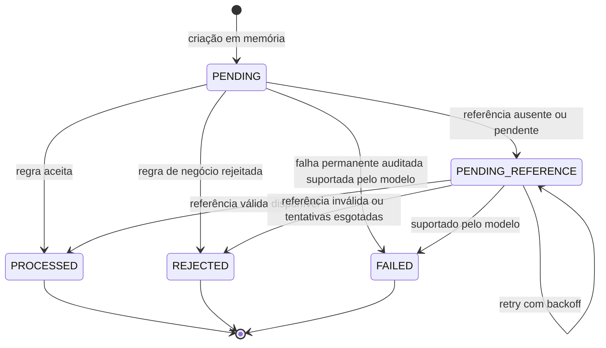
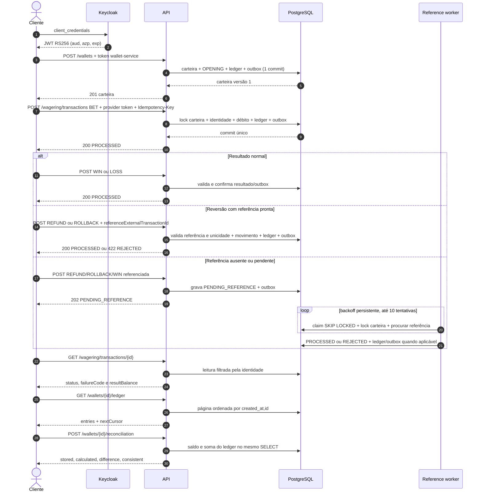
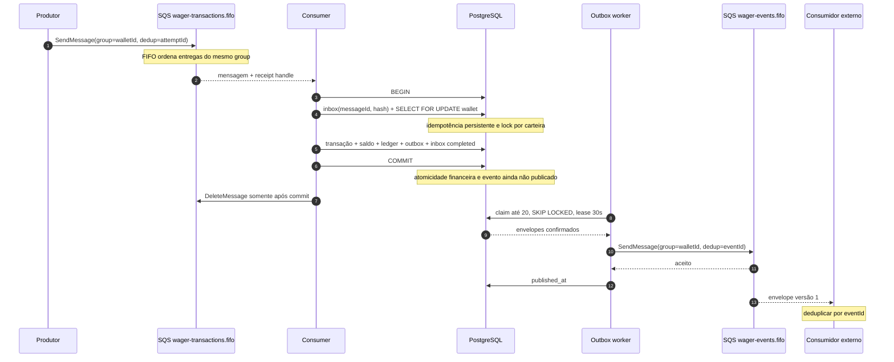

# Arquitetura e decisões

Este documento descreve o comportamento existente no código. As limitações conhecidas aparecem no final e fazem parte da avaliação da solução.

## Visão estrutural

```text
cmd/api                 composição Uber Fx e servidor HTTP
cmd/migrate             runner de migrations
internal/model          Money, Wallet, WagerTransaction e ledger
internal/usecases       regras de aplicação, decisões e portas
internal/controller     adaptação HTTP
internal/events         contratos dos eventos externos
internal/infra/config   configuração
internal/infra/oidc     autenticação JWT/OIDC
internal/infra/postgres implementação das portas e transações SQL
internal/infra/queue    cliente SQS
internal/infra/metrics  métricas em memória no formato Prometheus
internal/worker         consumer, outbox publisher e reference resolver
```

O domínio não importa Fx, HTTP, SQS, pgx ou bibliotecas de persistência. `internal/usecases` define interfaces que a infraestrutura PostgreSQL implementa. Essa direção de dependência mantém validação e transições de negócio testáveis sem transporte ou banco.

## Composição e ciclo de vida com Uber Fx

`cmd/api/main.go` carrega e valida a configuração antes de criar o app. A composição é dividida nos módulos nomeados `configuration`, `persistence`, `messaging` e `application`, usando `fx.Supply`, `fx.Provide` e `fx.Invoke`. Todas as dependências são construídas por construtores.

Na inicialização:

1. `config.Load` exige todas as configurações críticas e valida o timeout e o par de credenciais AWS.
2. `openPool` cria o pool pgx e executa `Ping` com prazo de 10 segundos.
3. O hook do gerenciador espera as três filas responderem a `GetQueueAttributes` e inicia os três workers.
4. O hook HTTP espera o JWKS conter ao menos uma chave e só então abre o listener.
5. O `fx.StartTimeout` é 90 segundos.

No `SIGTERM` ou `SIGINT`, o Fx executa os hooks em ordem inversa:

1. `http.Server.Shutdown` fecha o listener, interrompe novas conexões e aguarda requests ativos dentro de `APP_SHUTDOWN_TIMEOUT`.
2. O manager cancela o contexto compartilhado dos workers e aguarda todos terminarem.
3. O pool PostgreSQL é fechado depois que HTTP e workers deixam de usá-lo.

O consumer respeita cancelamento nas chamadas SQS e SQL. Se o shutdown ocorrer depois do tratamento bem-sucedido de uma mensagem, ele tenta apagá-la com um contexto curto de dois segundos; se o tratamento não terminou, libera sua visibilidade para reentrega. Claims de outbox abandonados expiram após 30 segundos.

Trade-off: os três workers vivem no mesmo binário da API, o que simplifica implantação e lifecycle. Cada réplica inicia seus próprios workers; a coordenação distribuída depende do SQS e do PostgreSQL, não da memória do processo.

## Autenticação e autorização

### IdP escolhido

O IdP é Keycloak. Ele oferece OIDC real, JWKS e client credentials e pode ser provisionado localmente pelo Compose. Isso permite testar assinatura e claims reais sem substituir o IdP por um mock.

O realm `apostas` contém `wallet-service`, `provider-a` e `provider-b`. Cada client recebe audience `apostas-api` por protocol mapper.

### Validação de credenciais

O middleware exige `Authorization: Bearer <JWT>` em todas as rotas exceto `/health/*`. Ele valida:

- algoritmo RS256;
- assinatura com a chave RSA encontrada pelo `kid` no JWKS;
- issuer igual a `OIDC_ISSUER_URL`;
- audience contendo `OIDC_AUDIENCE`;
- claim de expiração presente e válido;
- claim `azp` não vazio.

O JWKS é consultado a cada validação de token. Isso evita estado de chave local, mas aumenta latência e acopla cada request autenticado à disponibilidade do IdP.

### Modelo de permissões

O `providerId` confiável vem de `azp`, nunca apenas do corpo HTTP:

- `wallet-service` abre, lê e reconcilia carteiras, lê o ledger, consulta qualquer transação e acessa `/metrics`;
- um provider pode criar uma operação somente quando `body.providerId == azp`;
- um provider consulta apenas suas próprias transações;
- `GET /wagering/transactions/{id}` filtra por provider no SQL e retorna `404` para uma transação alheia, evitando revelar sua existência;
- `GET /providers/{providerId}/...` retorna `403` quando o provider do caminho não coincide com `azp`.

Comandos SQS não carregam JWT. O limite de confiança é a fila: somente produtores autorizados por IAM devem enviar para `wager-transactions.fifo`. O consumer ainda aplica todas as invariantes, idempotência e unicidade no banco, mas considera o `providerId` do payload confiável por ter vindo da fila protegida.

## Persistência e delimitação transacional

### Biblioteca

O projeto usa pgx v5 puro com `pgxpool` e SQL explícito. A escolha expõe locks, constraints, `SKIP LOCKED`, tipos PostgreSQL e fronteiras de transação sem abstrações implícitas de ORM. O custo é mais SQL e mapeamento manual.

### Fronteiras de transação

O `Store` concentra operações que precisam de atomicidade:

| Operação | Início e término da transação |
|---|---|
| Abertura | `CreateWallet` inicia antes de inserir carteira e confirma depois de `OPENING`, ledger e outbox. |
| Operação HTTP | `Execute` inicia antes do lock da carteira e confirma depois de transação, saldo, ledger e outbox. |
| Operação SQS | `ExecuteInbox` inicia antes da inbox; dentro da mesma transação chama `executeTx`, marca `completed_at` e confirma tudo junto. |
| Resolver de referência | `ResolvePendingReference` seleciona, trava, decide, atualiza saldo/transação, insere ledger/outbox e confirma junto. |
| Claim da outbox | `ClaimOutbox` seleciona com lock, grava o lease e confirma antes da publicação externa. |

O ack do SQS não pode participar de uma transação PostgreSQL. A garantia implementada é: inbox, resultado financeiro e conclusão da inbox estão no mesmo commit; `DeleteMessage` ocorre somente depois desse commit. Uma queda entre commit e ack provoca reentrega, que vira replay persistente sem reaplicar dinheiro.

Os testes do worker injetam a interrupção exatamente depois do commit da inbox e antes do `DeleteMessage`, e exatamente depois do `SendMessage` da outbox e antes de `MarkOutboxPublished`. Eles verificam, respectivamente, que a entrega fica sem ack para replay e que a recuperação republica o mesmo `eventId` antes de concluir a outbox.

## Money

`Money` é um value object imutável com `int64` em unidades mínimas e código ISO 4217. Em BRL, uma unidade mínima é um centavo. O JSON externo sempre usa string decimal e moeda:

```json
{"amount":"25.00","currency":"BRL"}
```

A persistência usa `BIGINT` para o valor e `CHAR(3)` para moeda. Nenhum parsing, cálculo, JSON ou SQL financeiro usa `float32` ou `float64`.

O parser aceita `25`, `25.0` e `25.00`; essas formas são normalizadas para `25.00` quando serializadas, antes do hash de idempotência. Ele rejeita vazio, sinal negativo, zero à esquerda como `01.00`, mais de duas casas, notação científica, `NaN`, `Infinity`, moeda desconhecida e overflow. Entradas financeiras externas aceitam somente valores não negativos; BET, WIN, REFUND e ROLLBACK exigem valor positivo, e LOSS exige zero.

Soma, subtração, negação e comparação exigem a mesma moeda. Cada operação verifica overflow. Valores negativos podem existir em cálculos internos, como a diferença de reconciliação, mas saldo, ledger e valores externos não podem ser negativos.

O intervalo de `int64` é de `-9.223.372.036.854.775.808` a `9.223.372.036.854.775.807` unidades mínimas. Com escala 2, o maior valor positivo representável é `92.233.720.368.547.758,07`; o valor negativo de maior módulo é reservado a cálculos internos. O sistema valida qualquer código ISO 4217 conhecido pela biblioteca, embora os cenários principais usem BRL.

Trade-off: centavos em `int64` tornam a aritmética simples e exata, mas fixam escala em duas casas e impõem o limite acima.

## Wallet, ledger e concorrência

Wallet é a raiz do agregado financeiro e encapsula ID, jogador, Money, versão e timestamps. `NewWallet` cria estado novo e `RehydrateWallet` recupera estado persistido sem gerar movimento ou evento. Crédito e débito são os únicos métodos públicos que mudam saldo; ambos validam moeda, data, valor, overflow e versão. Débito rejeita saldo negativo.

O par `(player_id, currency)` tem constraint única. A versão nasce em 1 e avança somente quando o saldo muda. Uma abertura positiva cria `OPENING` processada, crédito do saldo inteiro, ledger versão 1, `WagerTransactionProcessed` e `WalletBalanceChanged` no mesmo commit. Abertura com zero mantém versão 1 e não cria esses registros financeiros.

### Lock por carteira

Cada operação executa `SELECT ... FROM wallets WHERE id=$1 FOR UPDATE`. Isso serializa escritores da mesma carteira entre threads, processos e réplicas, evitando lost updates. Carteiras diferentes travam linhas diferentes e continuam em paralelo. Não existe mutex global.

A escolha por lock pessimista simplifica uma seção crítica curta e torna o resultado determinístico sob disputa. O custo é espera entre operações da mesma carteira; uma transação longa seguraria a fila daquela carteira.

### Garantias no schema

As migrations impõem:

- saldo não negativo e versão positiva;
- unicidade de carteira por jogador e moeda;
- unicidade de versão do ledger por carteira;
- um lançamento por `(wallet, transaction)`;
- equação de crédito/débito em cada lançamento;
- ledger imutável por trigger contra UPDATE e DELETE;
- identidade e moeda da carteira imutáveis;
- incremento exato de versão quando o saldo muda;
- triggers diferidos que exigem lançamento compatível para cada novo saldo;
- cadeia contínua entre `balance_before`, `balance_after` e versão;
- lançamento ligado a transação `PROCESSED`, no mesmo valor, carteira, moeda e direção esperada;
- histórico de transação terminal imutável e proibição de DELETE de carteira/transação.

Essas validações ocorrem no commit e protegem alterações SQL diretas feitas por uma conta comum. Uma conta com privilégio para modificar schema, desabilitar triggers ou atuar como superusuário continua capaz de contorná-las.

O ledger é append-only. Correções exigem REFUND ou ROLLBACK e geram uma nova entrada.

## WagerTransaction e máquina de estados

Tipos:

| Tipo | Regra financeira |
|---|---|
| `OPENING` | Interno; credita o saldo inicial positivo. |
| `BET` | Debita valor positivo. |
| `WIN` | Credita valor positivo; referência a uma BET é opcional. |
| `LOSS` | Processa valor zero sem alterar saldo ou versão. |
| `REFUND` | Credita integralmente uma BET processada. |
| `ROLLBACK` | Inverte integralmente BET, WIN ou REFUND. BET vira crédito; WIN/REFUND viram débito. |

Criação e reidratação são separadas. `NewWagerTransaction` sempre começa em `PENDING`; `RehydrateWagerTransaction` valida o estado já persistido sem transicionar, movimentar ou emitir eventos. Estados terminais não aceitam nova transição no domínio e também são protegidos por trigger.



| Origem | Destino válido | Uso real |
|---|---|---|
| `PENDING` | `PROCESSED` | Operação aceita. |
| `PENDING` | `REJECTED` | Regra financeira rejeitada. |
| `PENDING` | `PENDING_REFERENCE` | Referência ainda não utilizável. |
| `PENDING` | `FAILED` | Permitido no modelo, não persistido pelos fluxos atuais. |
| `PENDING_REFERENCE` | `PENDING_REFERENCE` | Permanência durante retries; o SQL atualiza tentativas e data. |
| `PENDING_REFERENCE` | `PROCESSED` | Resolver encontrou referência válida. |
| `PENDING_REFERENCE` | `REJECTED` | Referência inválida ou décima tentativa sem resolução. |
| `PENDING_REFERENCE` | `FAILED` | Permitido no modelo, não usado pelo resolver atual. |
| Terminal | qualquer | Proibido. |

No caminho normal, `PENDING` não é confirmado isoladamente: a criação e a decisão acontecem na mesma transação. Ele representa o estado inicial da entidade antes da decisão. `FAILED` existe no domínio e schema, mas nenhum fluxo atual o grava.

### Falhas transitórias e permanentes

Falha transitória de infraestrutura retorna erro sem commit financeiro. Exemplos: timeout PostgreSQL, perda de conexão e indisponibilidade SQS. No HTTP ela vira `503 TEMPORARY_UNAVAILABLE`. No consumer, a mensagem permanece na origem e recebe backoff; após cinco recebimentos o worker tenta enviá-la à DLQ.

Falha permanente de transporte inclui JSON malformado, envelope sem `messageId`, tipo diferente de `WagerTransactionRequested`, entrada de negócio inválida e conflito de identidade. O consumer envia essas mensagens à DLQ e só então apaga a origem.

Rejeição de negócio é um resultado persistido, não uma falha de infraestrutura. Exemplos: BET sem saldo, carteira incompatível ou reversão inválida. Ela cria transação `REJECTED` e evento correspondente; HTTP responde 422 e o consumer considera a mensagem concluída.

## Referências pendentes e reversões

Quando a referência não existe ou está `PENDING`/`PENDING_REFERENCE`, WIN referenciada, REFUND ou ROLLBACK fica `PENDING_REFERENCE`. O resolver consulta uma linha por vez com `FOR UPDATE SKIP LOCKED`, depois trava a carteira antes de decidir.

Se a referência termina em `REJECTED` ou `FAILED`, se pertence a outra carteira/jogador/rodada/moeda, tem tipo incompatível, valor diferente para reversão ou já foi revertida, a operação termina `REJECTED` com `INVALID_REFERENCE`.

O primeiro agendamento ocorre um segundo após a criação. Enquanto a referência continua pendente, os próximos atrasos são 1, 2, 4, 8, 16, 32, 64, 128 e 256 segundos. Na décima tentativa a transação é rejeitada com `REFERENCE_NOT_FOUND`. Sem atrasos operacionais, o período total é aproximadamente 512 segundos. O contador e o próximo horário ficam no PostgreSQL, portanto sobrevivem a reinício e múltiplas instâncias.

REFUND exige referência BET. ROLLBACK aceita BET, WIN ou REFUND. Reversões devem ter o mesmo valor integral da referência. Um índice único parcial sobre `reference_transaction_id` para REFUND/ROLLBACK processados garante no banco que apenas uma dessas reversões pode vencer. Isso também impede a combinação de REFUND e ROLLBACK processados sobre a mesma transação. Em uma disputa simultânea, uma operação pode observar a referência livre e depois receber conflito de unicidade no commit.

### Failure codes estáveis

Todas as rejeições são terminais. Corrigir o pedido exige uma nova identidade financeira e nova chave; reenviar a mesma chave retorna o resultado já persistido.

| Código | Causa | Classificação prática |
|---|---|---|
| `INSUFFICIENT_FUNDS` | BET deixaria saldo negativo. | Condição de saldo pode mudar, mas esta transação permanece rejeitada; uma nova operação pode ser enviada. |
| `REVERSAL_INSUFFICIENT_FUNDS` | ROLLBACK de WIN/REFUND não pode debitar o saldo atual. | Condição de saldo pode mudar; exige nova operação. É distinto da BET sem saldo. |
| `WALLET_MISMATCH` | Jogador ou moeda não coincide com a carteira. | Pedido definitivo e inválido; corrigir IDs/moeda em nova operação. |
| `INVALID_REFERENCE` | Referência terminal inválida, incompatível, já revertida ou com valor divergente. | Definitivo para esta operação. |
| `REFERENCE_NOT_FOUND` | Referência continuou ausente/pendente até a décima tentativa. | Definitivo para esta operação; pode-se criar outra após a referência existir. |
| `AMOUNT_OVERFLOW` | Movimento excederia `int64` ou outra aritmética monetária falhou. | Definitivo para este valor. |

## Idempotência

HTTP exige o header `Idempotency-Key`; ele é apenas aparado nas extremidades e nunca substituído por uma chave calculada. SQS recebe a mesma chave em `data.idempotencyKey`.

O hash de negócio é SHA-256 hexadecimal sobre JSON produzido por `encoding/json` a partir de um `map[string]any`. A implementação de Go ordena deterministicamente as chaves string. Os campos incluídos são, em ordem canônica:

```text
externalTransactionId
gameId
kind
money
playerId
providerId
referenceExternalTransactionId
roundId
walletId
```

`money` já foi normalizado para duas casas e moeda ISO antes da serialização. Ficam excluídos `Idempotency-Key`, `messageId`, `occurredAt`, receipt handle e demais metadados de transporte. Por isso a mesma operação HTTP e SQS produz o mesmo hash.

O PostgreSQL possui unicidade por `(provider_id, idempotency_key)` e por `(provider_id, external_transaction_id)`:

- mesma chave, mesmo ID externo e mesmo hash retorna o resultado armazenado com `idempotentReplay=true`;
- mesma chave com conteúdo diferente retorna conflito;
- mesmo ID externo com outra chave retorna conflito;
- replay de uma operação terminal devolve `result_balance_minor` observado naquela operação, mesmo que o saldo atual já tenha mudado.

Para SQS, `inbox_messages` também deduplica `(consumer_name, message_id)` de forma persistente. Seu `payload_hash` é SHA-256 dos bytes do corpo completo. Assim, o mesmo `messageId` com bytes diferentes é conflito, mesmo que os dois JSON sejam semanticamente equivalentes. Inbox, operação financeira e `completed_at` são confirmados no mesmo commit.

## Contratos HTTP

Corpos de erro do controller têm o formato `{"code":"..."}`. As respostas 401 emitidas pelo middleware usam texto simples (`missing bearer token`, `invalid bearer token` ou `missing client identity`).

| Situação | HTTP | Corpo |
|---|---:|---|
| Leitura ou operação processada | 200 | Recurso ou `Result` |
| Carteira criada | 201 | `{id, playerId, balance, version}` |
| Referência aguardando resolução | 202 | `{transactionId,status,balance,idempotentReplay}` |
| JSON/campo/UUID/Money/cursor/limit inválido | 400 | `{"code":"INVALID_INPUT"}` |
| Bearer ausente ou JWT inválido | 401 | texto simples do middleware |
| Client sem permissão | 403 | `{"code":"FORBIDDEN"}` |
| Carteira/transação não encontrada | 404 | `{"code":"NOT_FOUND"}` |
| Chave reutilizada, ID externo reutilizado ou constraint única concorrente | 409 | `{"code":"CONFLICT"}` |
| Rejeição financeira | 422 | `{transactionId,status:"REJECTED",balance,failureCode,idempotentReplay}` |
| Dependência/erro inesperado | 503 | `{"code":"TEMPORARY_UNAVAILABLE"}` |
| Readiness sem PostgreSQL | 503 | `{"code":"DATABASE_UNAVAILABLE"}` |
| Readiness sem alguma fila | 503 | `{"code":"SQS_UNAVAILABLE"}` |

O JSON de entrada rejeita campos desconhecidos, múltiplos valores JSON e corpo maior que 1 MiB. Ledger aceita `limit` de 1 a 100, padrão 50, e ordena por `(created_at,id)` com cursor Base64 URL-safe.

## Mensageria SQS

### Filas e parâmetros

- Entrada: `wager-transactions.fifo`.
- Saída: `wager-events.fifo`.
- DLQ: `wager-transactions-dlq.fifo`.
- Long polling: 10 segundos.
- Uma mensagem por `ReceiveMessage` por processo.
- Visibility timeout: 30 segundos.
- Máximo operacional: cinco recebimentos antes de envio explícito à DLQ; a fila local também possui redrive policy `maxReceiveCount=5`.

O produtor da entrada deve definir `MessageGroupId=walletId`. Isso fornece ordenação de entrega por carteira e permite que carteiras distintas sejam entregues em paralelo quando existem vários consumers. O consumer não recebe nem valida o group ID; a correção financeira continua protegida pelo lock e pela idempotência do banco se o produtor errar.

`MessageDeduplicationId` da entrada é responsabilidade do produtor. Ele deduplica apenas na janela do SQS; inbox e constraints fazem a deduplicação durável.

Erros transitórios recebem visibility delay exponencial de 1, 2, 4 e 8 segundos conforme o receive count. Payload malformado é permanente e vai para a DLQ no primeiro tratamento. Se o envio à DLQ falhar, a mensagem de origem não é apagada.

Uma mesma operação simultânea por HTTP e SQS trava a mesma carteira e consulta as mesmas constraints. A primeira confirma o efeito; a segunda encontra a identidade persistida e retorna replay. Se os conteúdos ou chaves divergem, ocorre conflito sem segundo lançamento.

## Outbox e eventos externos

Eventos são inseridos em `outbox_events` na mesma transação que altera carteira, transação e ledger. Nenhuma publicação SQS ocorre antes do commit.

O publisher busca até 20 eventos elegíveis por vez com `FOR UPDATE SKIP LOCKED`, grava lease de 30 segundos e confirma o claim. Depois publica em `wager-events.fifo` com:

- `MessageGroupId = aggregateId`, que é o wallet ID;
- `MessageDeduplicationId = eventId`;
- body igual ao envelope JSON persistido.

Após sucesso, grava `published_at`. Falha de publicação aumenta `attempts`, libera o claim e agenda backoff exponencial limitado a cinco minutos. Não há limite máximo nem DLQ para eventos da outbox; eles permanecem retentáveis.

O envelope é:

```json
{
  "eventId": "uuid",
  "eventType": "WalletBalanceChanged",
  "aggregateId": "wallet-uuid",
  "correlationId": "transaction-uuid",
  "causationId": "messageId-sqs-quando-aplicavel",
  "occurredAt": "2026-01-01T12:00:00Z",
  "version": 1,
  "data": {}
}
```

Eventos disponíveis:

| Evento | Conteúdo de `data` | Interpretação |
|---|---|---|
| `WagerTransactionProcessed` | `transactionId`, `providerId` opcional, `kind`, `status` | Operação terminou processada. Em OPENING, provider é omitido. |
| `WagerTransactionRejected` | `transactionId`, `providerId`, `kind`, `status`, `failureCode` | Operação terminou por regra de negócio. |
| `WagerTransactionPendingReference` | `transactionId`, `providerId`, `kind`, `status` | Operação aguarda referência. Um evento terminal posterior deve atualizar a visão do consumidor. |
| `WalletBalanceChanged` | carteira, transação, direção, Money, saldo anterior/posterior e versão | Movimento financeiro confirmado. |

Um consumidor externo deve validar `version`, rotear por `eventType`, correlacionar por `correlationId` e deduplicar por `eventId`. A entrega é pelo menos uma vez: uma queda depois de `SendMessage` e antes de `published_at` pode publicar novamente o mesmo evento.

## Fluxo típico da API



## Fluxo assíncrono e pontos de garantia



As garantias entram nos seguintes pontos:

- ordem de entrada por carteira: `MessageGroupId=walletId`, desde que o produtor cumpra o contrato;
- exclusão mútua financeira: lock da linha da carteira;
- idempotência: inbox, hash de negócio e constraints únicas;
- atomicidade: um commit para transação, saldo, ledger, outbox e inbox;
- publicação posterior ao commit: somente o outbox worker chama SQS de saída;
- recuperação: receipt não apagado, claim com lease e retries persistentes;
- deduplicação de saída: `eventId` estável no SQS e no consumidor externo.

## Observabilidade

Logs usam `slog` em JSON e incluem IDs de mensagem, transação, carteira e provider quando disponíveis. Tokens e corpos financeiros completos não são registrados.

`/metrics`, restrito a `wallet-service`, expõe contadores de resultados, duplicatas, retries SQS, DLQ, conflitos, eventos publicados, retries/atraso de outbox, latência do consumer e divergências de reconciliação. O registry é local e em memória; reiniciar uma réplica zera seus contadores.

`/health/live` verifica apenas que o processo responde. `/health/ready` executa `Ping` no PostgreSQL e `GetQueueAttributes` nas três filas. A disponibilidade do JWKS é exigida durante startup e durante cada request autenticado, mas não é consultada pelo endpoint de readiness.

## Decisões consolidadas

| Tema | Decisão | Motivo e trade-off |
|---|---|---|
| Dinheiro | `int64` em unidades mínimas, escala 2 e moeda ISO. | Exatidão e ausência de ponto flutuante; limita escala e intervalo. |
| Transações | Entidade encapsulada com criação, reidratação e estados terminais. | Impede transições acidentais; `FAILED` ficou sem produtor no fluxo atual. |
| Idempotência | SHA-256 canônico + constraints + inbox PostgreSQL. | Sobrevive a reinícios e unifica HTTP/SQS; exige guardar identidades indefinidamente. |
| Locks | `SELECT FOR UPDATE` por carteira. | Evita lost update entre processos sem bloquear carteiras independentes. |
| Referências | Estado persistente, `SKIP LOCKED`, backoff e dez tentativas. | Aceita chegada fora de ordem; o prazo é fixo e não configurável. |
| Reversões | Valor integral e uma reversão processada por referência. | Evita devolução dupla; não oferece reversão parcial. |
| Ledger | Append-only e protegido por constraints/triggers diferidos. | Auditoria forte mesmo contra SQL direto; aumenta complexidade das migrations. |
| Inbox | Registro e conclusão no mesmo commit financeiro. | Reentrega não duplica efeito; ack SQS permanece fora da transação SQL. |
| Outbox | Evento persistido no commit, publicado depois com lease. | Impede publicação anterior ao commit; entrega é pelo menos uma vez. |
| Autenticação | Keycloak OIDC, JWT RS256, issuer/audience/expiração. | Testável localmente com protocolo real; consulta JWKS por request. |
| Autorização | `azp` define identidade interna ou provider. | Evita confiar no provider do corpo; SQS confia em IAM da fila. |
| Fx | Módulos, construtores, hooks e timeouts. | Ordem explícita de startup/shutdown; workers compartilham o processo HTTP. |
| Shutdown | HTTP para entradas, workers cancelam/terminam, pool fecha por último. | Libera trabalho com segurança dentro do timeout configurado. |

## Evoluções futuras

1. O publisher ordena claims por `occurred_at`, e o SQS agrupa por carteira. Com várias réplicas, dois publishers podem reivindicar lotes adjacentes e enviá-los em ordem diferente da ordem do banco. Portanto, o código não garante ordem estrita global dos eventos de uma carteira entre publishers concorrentes. Consumidores devem usar `walletVersion` nos eventos financeiros quando precisarem ordenar estado.
2. O consumer não valida que o `MessageGroupId` recebido corresponde a `walletId`, pois esse atributo não é solicitado/mapeado pelo adapter. O contrato depende do produtor; locks e idempotência preservam integridade mesmo com group incorreto, mas o paralelismo e a ordem FIFO esperados podem ser perdidos.
3. A autorização IAM real não faz parte dos testes automatizados. O E2E usa LocalStack, que não prova enforcement equivalente à AWS. Existe uma policy mínima de implantação e a integração foi desenhada para credenciais reais.
4. JWKS não possui cache. Cada request autenticado depende de uma chamada ao IdP, e readiness não testa o IdP depois do startup.
5. `FAILED` é modelado e aceito pelo schema, mas os fluxos atuais não persistem esse estado. Regras de negócio usam `REJECTED`; payload permanente inválido vai à DLQ sem criar uma transação válida.
6. O retry de referência usa dez tentativas e tempos fixos no código; não há configuração por ambiente nem TTL por timestamp. O failure code final é `REFERENCE_NOT_FOUND`, inclusive quando a referência existe mas continua pendente até o limite.
7. A outbox tenta publicar indefinidamente com backoff máximo de cinco minutos. Não existe DLQ de eventos nem limite de tentativas da outbox.
8. Métricas são mantidas em memória por réplica e zeram no restart. Não há tracing distribuído nem exportador Prometheus dedicado; `/metrics` apenas serve o snapshot local.
9. O limite de 30 segundos para visibility e lease pressupõe operações normais mais curtas. Um processamento mais longo pode ser recebido ou reivindicado novamente; a integridade financeira continua protegida, mas pode haver trabalho duplicado e republicação.
10. A proteção contra alteração direta depende de constraints e triggers. Superusuários ou contas com permissão para mudar/desabilitar o schema ficam fora do modelo de ameaça.
11. Não há testes de carga prolongados, caos automatizado, cache/rotação de JWKS sob falha nem benchmark de throughput.
